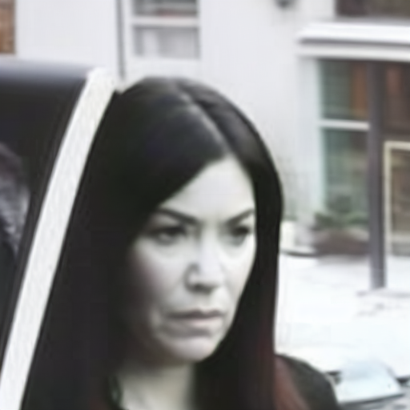
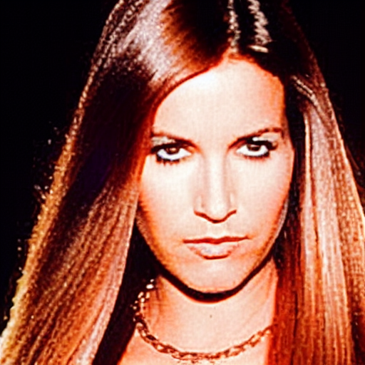

<h1 align="center"> Forensic Image Generator using Stable Diffusion + LoRA</h1>

<p align="center">
  <b>BISAG-N Summer Internship Project</b><br>
  AI-Powered Forensic Facial Reconstruction from Textual Descriptions
</p>

<p align="center">
  
  
  
  
  
  
  
</p>

---

## Overview

This project presents a specialized forensic image generation system built using Stable Diffusion and Low-Rank Adaptation (LoRA). The system transforms detailed textual descriptions into realistic forensic-style facial images, helping bridge the gap between eyewitness descriptions and visual reconstruction.

Traditional sketch-based reconstruction methods are often time-consuming and highly dependent on artistic expertise. This work explores how modern Generative AI can accelerate forensic visualization through domain-adapted diffusion models.

---

## Key Features

- Stable Diffusion based forensic image generation
- Parameter-efficient LoRA fine-tuning
- Custom forensic token conditioning
- Streamlit-based graphical user interface
- Batch image generation support
- Mixed precision FP16 training
- SafeTensors model serialization
- Reproducible inference with fixed seeds
- Research-focused implementation for forensic applications

---

## System Architecture

```text
Text Description
        │
        ▼
Prompt Processing
        │
        ▼
Tokenizer + Text Encoder
        │
        ▼
Stable Diffusion Pipeline
        │
        ▼
LoRA Adaptation Layer
        │
        ▼
Latent Denoising Process
        │
        ▼
Generated Forensic Portrait
```

---

## Sample Results

### Example 1 — Surveillance Style Reconstruction

**Input Prompt**

> A grainy surveillance-style photo of a young female with short dark straight black hair, pale complexion, neutral serious expression, minimal makeup, captured in an outdoor setting, for forensic facial reconstruction.



### Example 2 — Criminal Database Style Reconstruction

**Input Prompt**

> A detailed forensic image of a young attractive female with long straight brown hair, high cheekbones, oval face, wearing earrings and a necklace, heavy makeup and an intense gaze, as seen in a criminal database.




---

## Streamlit Application

The project includes a user-friendly Streamlit interface that allows investigators and researchers to generate forensic portraits without interacting directly with model code.

Features:

- Prompt-based image generation
- Adjustable inference steps
- Random seed control
- Real-time image rendering
- Easy experimentation and testing


---

## Model Pipeline

### Training Workflow

1. Collect forensic-style image dataset
2. Create descriptive image captions
3. Prepare image-caption pairs
4. Load Stable Diffusion base model
5. Add custom forensic token
6. Apply LoRA adapters to UNet
7. Fine-tune on forensic dataset
8. Save LoRA weights in SafeTensors format

### Inference Workflow

1. User enters forensic description
2. Prompt is tokenized
3. Stable Diffusion generates latent representation
4. LoRA weights inject forensic features
5. Denoising reconstructs image
6. Final forensic portrait is produced

---

## Dataset

The model was trained on a curated forensic-style facial image dataset containing multiple facial characteristics and visual conditions.

Dataset Characteristics:

- Male and Female Subjects
- Different Hairstyles
- Various Facial Structures
- Surveillance-Style Images
- Criminal Database Portraits
- Different Accessories
- Multiple Expressions
- Controlled Facial Descriptions

Dataset Structure:

```text
data/
├── images/
└── captions.csv
```

Example Caption:

```csv
filename,caption
person1.jpg,<forensic_details> Young female with short black hair and pale complexion
```

---

## Training Configuration

| Parameter | Value |
|------------|---------|
| Base Model | Stable Diffusion v1.5 |
| Fine-Tuning Method | LoRA |
| Framework | Hugging Face Diffusers |
| Optimizer | AdamW |
| Precision | FP16 |
| Resolution | 512×512 |
| Training Type | Supervised Fine-Tuning |
| Output Format | SafeTensors |

---

## Project Structure

```text
forensic_image_generator/
│
├── assets/
│   ├── banner.png
│   ├── architecture.png
│   ├── streamlit_app.png
│   ├── result_1.png
│   └── result_2.png
│
├── data/
│   ├── images/
│   └── captions.csv
│
├── generated_images/
├── output_lora_model/
│
├── app.py
├── train_lora.py
├── generate_images.py
├── run_model.py
├── requirements.txt
│
├── docs/
│   ├── Internship_Report.pdf
│   └── Presentation.pdf
│
└── README.md
```

---

## Installation

### Clone Repository

```bash
git clone https://github.com/014-Jayal/forensic_image_generator.git
cd forensic_image_generator
```

### Create Virtual Environment

```bash
python -m venv .venv
```

### Install Dependencies

```bash
pip install -r requirements.txt
```

### Hugging Face Login

```bash
huggingface-cli login
```

---

## Training

```bash
python train_lora.py
```

Generated checkpoints will be stored inside:

```text
output_lora_model/
```

---

## Inference

### Streamlit Application

```bash
streamlit run app.py
```

### Command Line

```bash
python generate_images.py
```

---

## Research Contributions

This work explores the adaptation of diffusion-based foundation models for forensic applications.

Research Areas:

- Generative AI
- Computer Vision
- Diffusion Models
- Forensic Reconstruction
- Facial Attribute Conditioning
- Parameter Efficient Fine-Tuning
- Human-Centered AI

---

## Limitations

- Dependent on GPU acceleration
- Performance influenced by dataset quality
- Generated outputs are probabilistic
- Not intended for direct legal identification

---

## Future Enhancements

- ControlNet Integration
- Sketch-to-Face Generation
- Age Progression and Regression
- Identity Preservation
- Multi-Person Reconstruction
- Face Verification Integration
- Diffusion Transformer Models
- Real-Time Deployment

---

## Authors

### Jayal Shah
AI Engineer | Generative AI | Computer Vision

- GitHub: https://github.com/014-Jayal
- LinkedIn: https://www.linkedin.com/in/jayal-shah04/

### Niheel Prajapati

Project Collaborator

---

## Acknowledgements

Developed during the Summer Internship Program at:

**Bhaskaracharya National Institute for Space Applications and Geo-Informatics (BISAG-N)**

Guided By:

- Dr. Manoj Pandya (External Guide)
- Ms. Zalak Thakker (Internal Guide)

---

## Citation

```bibtex
@misc{forensic_generator_2025,
  title={Forensic Image Generator using Stable Diffusion and LoRA},
  author={Jayal Shah and Niheel Prajapati},
  year={2025},
  institution={BISAG-N}
}
```

---

## Disclaimer

This project is intended for educational and research purposes only.

The generated images are AI-generated visual approximations and should not be considered factual identifications. Any use in forensic workflows should involve qualified human oversight and additional corroborating evidence.
